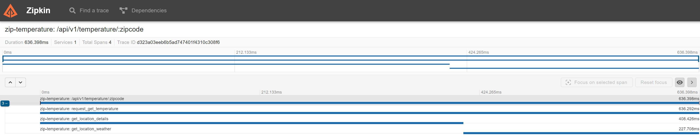

# Zip temperature

Fiber web server.

## Running the server

The live reloading server can be run by the following commands:

``make up``

or

``docker-compose up``

There two end-points:

- POST ``localhost:8081/api/v1/temperature``
  - This end-point will pass through validator service
  - Request body: {"zipcode": "valid zipcode"}
- GET ``localhost:8080/api/v1/temperature/:zipcode``

Examples request can be found on api folder.

To be able to properly run the server um must add a valid WEATHER_API_KEY on app.env file. Might be necessary to restart
the server after editing app.env file.

## Zipkin 
- URL: http://localhost:9411/zipkin

